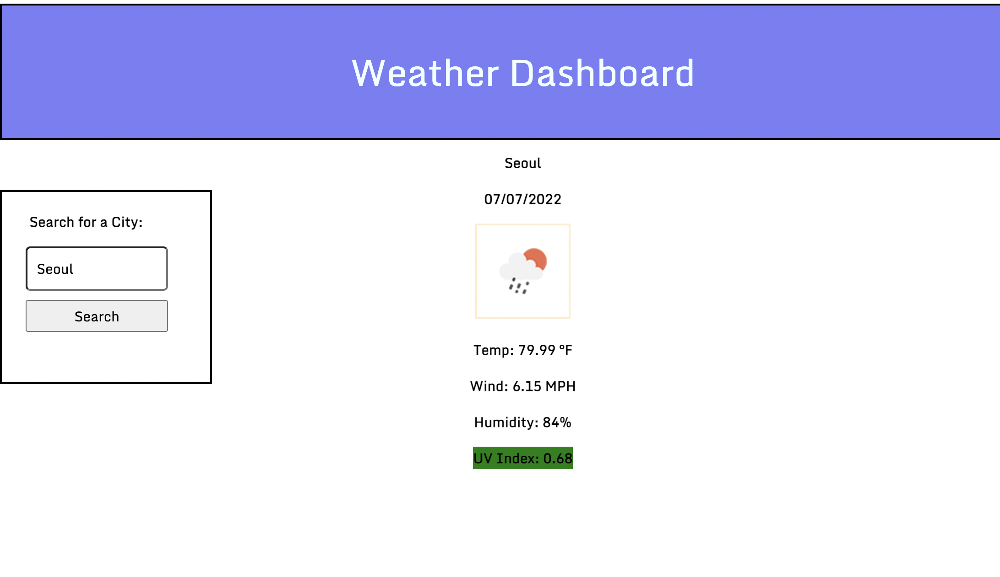

# Challenge 6 //  Server-Side APIs Challenge: Weather Dashboard

Using third party APIs and HTML and CSS, a weather dashboard application will be created that allow users to see the weather forecast for multiple location. This application will run in the browser.
Link to [Application]:(https://pppreap.github.io/challenge6_weatherapi/)

# User Story

An traveler wants to be able to view current and future weather forecast for multiple cities to be able to plan their trip accordingly. 
A developer will create an application that fulfill this criteria and more.

## Criteria

**You will need to run this application in a browser.**

The weather dashboard application will be used to view weather forecast for multiple cities:

There will be a weather dashboard with **form inputs**.

WHEN the **user search** for a city,
THEN the user is **presented with current and future conditions** for that city and that **city is added to the search history**.

WHEN  the user **view current weather conditions** for that city,
THEN  the user is  **presented with the city name, the date, an icon representation of weather conditions, the temperature, the humidity, the wind speed, and the UV index.**

WHEN the user **view the UV index**,
THEN the userus  **presented with a color that indicates whether the conditions are favorable, moderate, or severe.**

WHEN the user **view future weather conditions for that city,**
THEN the user is **presented with a 5-day forecast that displays the date, an icon representation of weather conditions, the temperature, the wind speed, and the humidity.**

WHEN the user **click on a city in the search history**
THEN the user again is presented with **current and future conditions for that city.**

### Assets
This is an image of the working dashboard application.

#### Links
[Github Repository](https://github.com/pppreap/challenge6_weatherapi) 
///
[Link to Weather Dashboard](https://pppreap.github.io/challenge6_weatherapi/)

#### Credits
User Story Criteria from Michigan State University Coding Boot Camp 2022.
[https://openweathermap.org/api]

